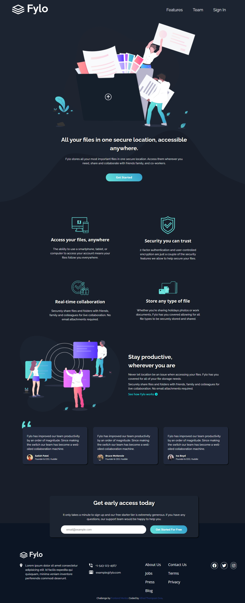

# Frontend Mentor - Fylo dark theme landing page solution

## SideHustle internship task 2.0

This is a solution to the [Fylo dark theme landing page challenge on Frontend Mentor](https://www.frontendmentor.io/challenges/fylo-dark-theme-landing-page-5ca5f2d21e82137ec91a50fd). Frontend Mentor challenges help you improve your coding skills by building realistic projects.

## Table of contents

-   [Overview](#overview)
    -   [The challenge](#the-challenge)
    -   [Screenshot](#screenshot)
    -   [Links](#links)
-   [My process](#my-process)
    -   [Built with](#built-with)
    -   [What I learned](#what-i-learned)
    -   [Continued development](#continued-development)
    -   [Useful resources](#useful-resources)
-   [Author](#author)

## Overview

The challenge is to build out this landing page and get it looking as close to the design as possible.

One can use any tools you like to help you complete the challenge. So if you've got something you'd like to practice, feel free to give it a go.

### The challenge

Users should be able to:

-   View the optimal layout for the site depending on their device's screen size
-   See hover states for all interactive elements on the page

### Screenshot

### Links

-   Solution URL: [Here's a link to my solution on Frontend Mentor.](https://your-solution-url.com)
-   Live Site URL: [And here's this bad boy in action](https://your-live-site-url.com)

## My process

### Built with

-   Semantic HTML5 markup
-   CSS custom properties
-   Flexbox
-   CSS Grid
-   Desktop-first workflow

### What I learned

I realized, I have a lot to learn about html5, flexbox and css grid.

### Continued development

In the future i want to be proficient in css layouts (css grid and flex box), during the course of this project i got to better understand background images, their sizing as well as their positioning. I still have a long way to go but am really happy with the progress.

I am also glad that I am getting more comfortable with flexbox.

It is always fun to work with both grid and flex layouts.

### Useful resources

-   [Telusko | Form Validation](https://www.youtube.com/watch?v=WeIRHETbcLs) - This helped me learn how to write regular expression in Javascript. I really liked this pattern and will use it going forward.

## Author

-   Frontend Mentor - [@ovietom](https://www.frontendmentor.io/profile/ovietom)
-   Twitter - [@Eivo_official](https://www.twitter.com/Eivo)
-   Linkedin - [Thompson Alfred](https://www.linkedin.com/in/alfredthompsonovie)
